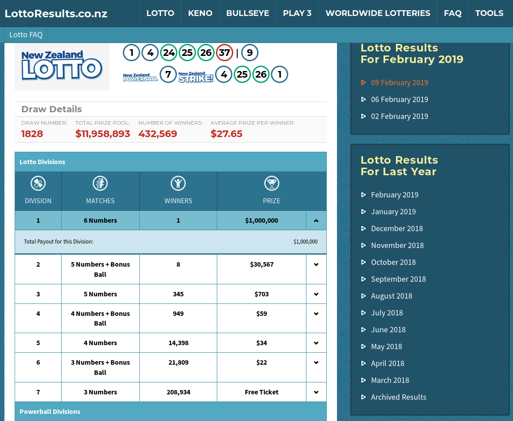
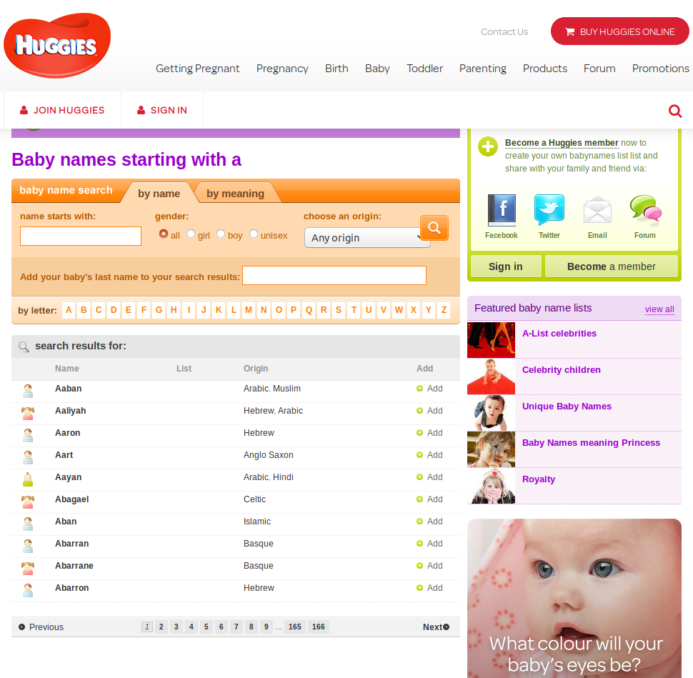
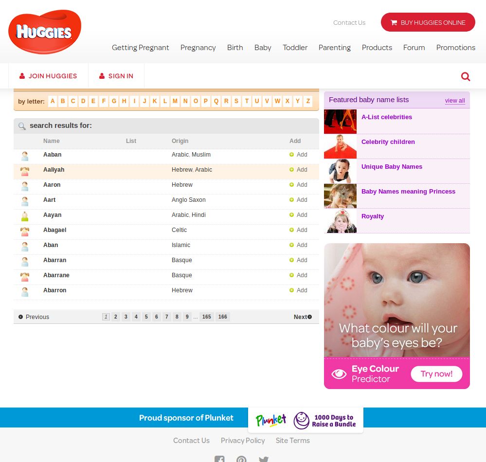
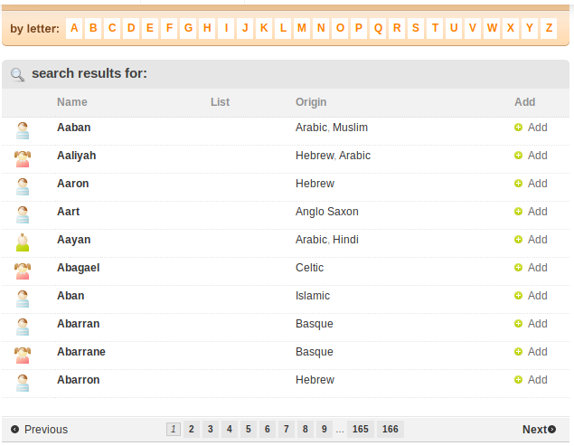
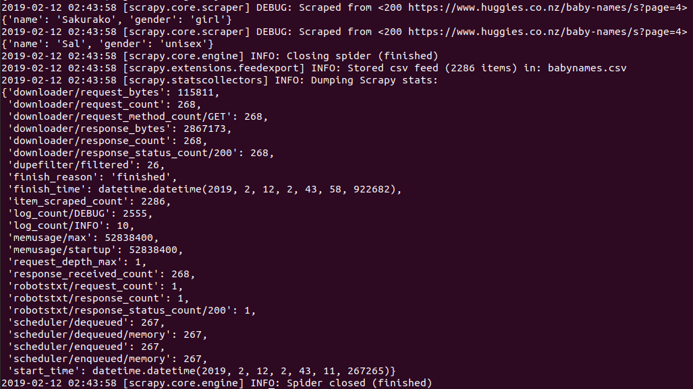
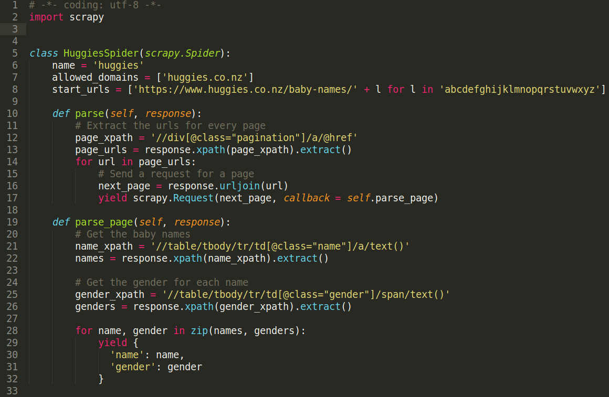

<style>
pre code, pre, code {
  white-space: pre !important;
  overflow-x: scroll !important;
  word-break: keep-all !important;
  word-wrap: initial !important;
}
</style>

```{r setup, include=FALSE}
knitr::opts_chunk$set(echo = FALSE, message=FALSE, warning=FALSE)
```

```{r}
library(tidyverse)
library(kableExtra)
library(reticulate)
```

## Overview

- Motivation
- Stuff you should know
- Scraping baby names with scrapy
- The results

# Motivation

## What the heck is..

### **Web Scraping?**

Web scraping is the practice of extracting data directly from websites online

### **Scrapy?**

Scrapy is a python library for web scraping with heaps of useful functionality

## Turn this..

```{r fig.align='center', out.width=650}

```

## Into this..

```{r}
auckland_flatmates <- read_csv("data/flatmates.csv")
auckland_flatmates %>%
  head(2) %>%
  mutate_all(function(x) str_trunc(x, 50)) %>%
  knitr::kable() %>%
  kable_styling(font_size = 15) %>%
  scroll_box(width = "750px")
```

## Or this..

```{r fig.align='center', out.width=650}

```

## Into this..

```{}
{ "date": "06-february-2019",
  "ball_1": "6", "ball_2": "8", "ball_3": "14", "ball_4": "15", "ball_5": "26", "ball_6": "31",
  "bonus": "34",
  "powerball": "10",
  "strike_1": "6", "strike_2": "15", "strike_3": "14", "strike_4": "26",
  "draw_number": "1827",
  "total_prize_pool": "$2,316,924",
  "number_of_winners": "249,754",
  "average_prize_per_winner": "$9.28",
  "results_table": [
    {"division": "1", "matches": "6 Numbers  ",
    "winners": "1", "prize": "$1,000,000", "payout": "$1,000,000"},
    {"division": "2", "matches": "5 Numbers  + Bonus Ball ",
    "winners": "7", "prize": "$23,248", "payout": "$162,736"},
    ...
```

## Our Example

We want to collect a list of babynames from [huggies.co.nz](http://huggies.co.nz/baby-names)

```{r fig.align='center', out.width=650}

```

# Stuff you should know

## How not to be a jerk

- If there is a public API, use it instead
- Always provide a User Agent string
- Request data at a reasonable rate. Never be confused for a DDoS attack
- Only save the data you need from the page
- Respect any content you keep, don't pass it off as your own
- Look for ways to return value to the site owner
- Credit the site owner in any article or posts you make
- Respond in a timely fashion to any outreach
- Create new value from the data, don't simply duplicate it

Read more [here](https://towardsdatascience.com/ethics-in-web-scraping-b96b18136f01)

## Robots.txt

`robots.txt` is a text file site owners create to instruct bots (typically search engine robots) how to crawl pages on their website.

[huggies.co.nz/robots.txt](http://huggies.co.nz/robots.txt) looks like this:

```
User-agent: *
Disallow:
Disallow: /hot-milk-promo-signup/new
Disallow: /facebook/

Sitemap: https://www.huggies.co.nz/sitemap.xml
```

This means we are allowed to scrapy the domain [huggies.co.nz/baby-names](http://huggies.co.nz/baby-names)

## Robots.txt

Most websites have a `robots.txt`, usually it's worth checking out to get a sense of the site owners attitude 
towards web scrapers. Some websites are more strict than others.

Scrapy will automatically get and enforce any rules on a sites `robots.txt`, so you don't need to think about it.
This is not the case with `BeautifulSoup`.

# Starting with Scrapy

## Create a Project

Work with scrapy is always done inside of a project. To create the `babynames` project simply run:

```
scrapy startproject babynames

# New Scrapy project 'babynames', using template directory '/usr/local/lib/python3.6/dist-packages/scrapy/templates/project', created in:
#     /work/babynames
# 
# You can start your first spider with:
#     cd babynames
#     scrapy genspider example example.com
```

## Create a project

This creates the following directories:

```
## babynames
## └── babynames
##     ├── __init__.py
##     ├── items.py
##     ├── middlewares.py
##     ├── pipelines.py
##     ├── __pycache__
##     ├── settings.py
##     └── spiders
##         ├── __init__.py
##         └── __pycache__
## 
## 4 directories, 7 files
```

## Project contents

`items.py`, `middlewares.py` and `pipelines.py` are advanced features of scrapy, which manage asynchronous file downloads

`settings.py` is a config file that controls the behaviour of any web scrapers you create

The `spiders/` folder is where the web scrapers you write are placed

## Settings.py

```{python3 echo=TRUE}
BOT_NAME = 'babynames'

SPIDER_MODULES = ['babynames.spiders']
NEWSPIDER_MODULE = 'babynames.spiders'


# Crawl responsibly by identifying yourself (and your website) on the user-agent
USER_AGENT = 'https://github.com/mathematiguy/intro-to-scrapy (calebjdmoses@gmail.com)'

# Obey robots.txt rules
ROBOTSTXT_OBEY = True

# Configure maximum concurrent requests performed by Scrapy (default: 16)
CONCURRENT_REQUESTS = 4

# Configure a delay for requests for the same website (default: 0)
# See https://doc.scrapy.org/en/latest/topics/settings.html#download-delay
# See also autothrottle settings and docs
DOWNLOAD_DELAY = 3
# The download delay setting will honor only one of:
CONCURRENT_REQUESTS_PER_DOMAIN = 4
# ... and more ...
```

## Create a spider

Now we want to create a spider, which is the script that will control how we scrape the website

To do this, we simply name the project, and the domain where we want to start scraping by running:

```
scrapy genspider huggies huggies.co.nz

# Created spider 'huggies' using template 'basic' in module:
#   babynames.spiders.huggies
```

## Create a spider

This creates `spiders/huggies.py` with the following contents:

```{python3 echo=TRUE}
# -*- coding: utf-8 -*-
import scrapy


class HuggiesSpider(scrapy.Spider):
    name = 'huggies'
    allowed_domains = ['huggies.co.nz']
    start_urls = ['http://huggies.co.nz']

    def parse(self, response):
        pass
```

## Create a spider

In `scrapy`, web scraping is done by scripts called 'spiders'. A basic spider consists of the following:

- A `name`
- A list of `allowed_domains` where the spider is allowed to go
- A list of `start_urls` to start downloading from
- A `parse` method, which describes what to do at each page

The `parse` method yields either:

- A `dict` containing the data we want to save
- A `scrapy.Request`, which requests a new url with a callback to another `parse` method

## Create a spider

First off we modify the `start_urls` to span the urls we want to crawl

```{python3 echo=TRUE}
# -*- coding: utf-8 -*-
import scrapy


class HuggiesSpider(scrapy.Spider):
    name = 'huggies'
    allowed_domains = ['huggies.co.nz']
    start_urls = ['http://huggies.co.nz/baby-names/' + l for l in 'abcdefghijklmnopqrstuvwxyz']

    def parse(self, response):
        pass
```

## Start developing

I usually do the work of testing code to put in my spiders in an interactive shell. You can start the scrapy interactive
shell by running:

```
scrapy shell huggies.co.nz/baby-names/a

# .. A bunch of logs here ...
# [s] Available Scrapy objects:
# [s]   scrapy     scrapy module (contains scrapy.Request, scrapy.Selector, etc)
# [s]   crawler    <scrapy.crawler.Crawler object at 0x7fb5ebbe1898>
# [s]   request    <GET http://huggies.co.nz/baby-names>
# [s]   response   <200 https://www.huggies.co.nz/baby-names>
# [s]   settings   <scrapy.settings.Settings object at 0x7fb5ea50b898>
# [s]   spider     <DefaultSpider 'default' at 0x7fb5e9788860>
# [s] Useful shortcuts:
# [s]   view(response)    View response in a browser
# >>>
```

## Start developing

From inside the scrapy shell, you can see everything that your spider can see on the website and test code that will be 
migrated to `huggies.py` when it works.

Usually the goal is to handle the `response` object so as to get either:

- The data you want to save
- Any urls to the next place you want to go

## Try things out

We can inspect `response.body` like so:

```
>>> print(response.body[:500])
<!DOCTYPE html>
<!--[if lt IE 8]>      <html lang="en" class="ie7 ie nz"> <![endif]-->
<!--[if IE 8]>         <html lang="en" class="ie8 ie nz"> <![endif]-->
<!--[if IE 9]>         <html lang="en" class="ie9 ie nz"> <![endif]-->
<!--[if gt IE 9]><!--> <html lang="en" class="nz">    <!--<![endif]-->

<head>
  <meta charset="UTF-8" />
<script type="text/javascript">window.NREUM||(NREUM={});
NREUM.info={"beacon":"bam.nr-data.net","errorBeacon":...
```

If your attempt to fetch the website failed, usually this output will say so somehow

## Back to the website

```{r fig.align='center', out.width = "600px"}

```

## Back to the website

```{r fig.align='center', out.width = "600px"}

```

# Pagination

## Getting the page urls

Often we want spider to traverse the website page by page.

To do this, we need to extract the links to any pages we want to visit first before we start extracting any data.

We use the 'inspect element' tool on our browser to find the xpath for each of the elements that we want 
to scrape from the page.

Usually the xpath you get from the browser requires some modification before it will get exactly what you
need. This takes some practice, but you can use trial and error in the scrapy shell to test what works.

## Getting the page urls

First we grab the first xpath we can from the website

```
>>> page_xpath = '/html/body/div[2]/div[2]/div[2]/div[3]/div[2]/a[1]'
>>> response.xpath(page_xpath).extract()
['<a rel="next" href="/baby-names/a?page=2">2</a>']
```

We can truncate the xpath on the left to make the code easier to read, so long as we start the xpath with `'//'`.
And we can also select a `<div>` tag by class using xpath as follows:

```
>>> page_xpath = '//div[@class="pagination"]/a[1]'
>>> response.xpath(page_xpath).extract()
['<a rel="next" href="/baby-names/a?page=2">2</a>']
```

## Getting the page urls

Then we can replace `a[1]` with just `a` to get all of the `a` tags under the pagination div.

```
>>> page_xpath = '//div[@class="pagination"]/a'
>>> response.xpath(page_xpath).extract()
['<a rel="next" href="/baby-names/a?page=2">2</a>',
 '<a href="/baby-names/a?page=3">3</a>',
 '<a href="/baby-names/a?page=4">4</a>',
 '<a href="/baby-names/a?page=5">5</a>',
 '<a href="/baby-names/a?page=6">6</a>',
 '<a href="/baby-names/a?page=7">7</a>',
 '<a href="/baby-names/a?page=8">8</a>',
 '<a href="/baby-names/a?page=9">9</a>',
 '<a href="/baby-names/a?page=165">165</a>',
 '<a href="/baby-names/a?page=166">166</a>',
 '<a class="next_page" rel="next" href="/baby-names/a?page=2">Next</a>']
```

## Getting the page urls

Then we can extract the `href` from within the `<a>` tag like below:

```
>>> page_xpath = '//div[@class="pagination"]/a/@href'
>>> response.xpath(page_xpath).extract()
['/baby-names/a?page=2',
 '/baby-names/a?page=3',
 '/baby-names/a?page=4',
 '/baby-names/a?page=5',
 '/baby-names/a?page=6',
 '/baby-names/a?page=7',
 '/baby-names/a?page=8',
 '/baby-names/a?page=9',
 '/baby-names/a?page=165',
 '/baby-names/a?page=166',
 '/baby-names/a?page=2']
```

## Parsing all pages

Now we're ready to write the `parse` method in `huggies.py`. The goal of `parse` is simple, to get each page url and pass
it forward to `parse_page`, which will parse each individual page.

```{python3 echo=TRUE}
def parse(self, response):
    pass
```

## Parsing all pages

Now we're ready to write the `parse` method in `huggies.py`. The goal of `parse` is simple, to get each page url and pass
it forward to `parse_page`, which will parse each individual page.

```{python3 echo=TRUE}
def parse(self, response):
    # Extract the urls for every page
    page_xpath = '//div[@class="pagination"]/a/@href'
    page_urls = response.xpath(page_xpath).extract()
    for url in page_urls:
        # Send a request for a page
        next_page = response.urljoin(url)
        yield scrapy.Request(next_page, callback = self.parse_page)

def parse_page(self, response):
    # This parses the names from each page
    pass
```

# Extracting data

## Getting the baby names

As before, we grab the first xpath we can from the website

```
>>> name_xpath = '/html/body/div[2]/div[2]/div[2]/div[3]/table/tbody/tr[1]/td[2]/a'
>>> response.xpath(name_xpath).extract()
['<a href="/baby-names/boys/a/aaban">Aaban</a>']
```

Then we truncate the xpath on the left to make it simpler

```
>>> name_xpath = '//table/tbody/tr[1]/td[2]/a/text()'
>>> response.xpath(name_xpath).extract()
['<a href="/baby-names/boys/a/aaban">Aaban</a>']
```

## Getting the baby names

We replace the `td[1]` entry with `td[@class="name"]` so we get all `<td>` tags with a 
`class` of `"name"`, instead of just the first element.

```
>>> name_xpath = '//table/tbody/tr[1]/td[@class="name"]/a/text()'
>>> response.xpath(name_xpath).extract()
['<a href="/baby-names/boys/a/aaban">Aaban</a>']
```

Note that this doesn't change the output, because the target is the same. We're just referring to the tags we want
by class instead of by index.

## Getting the baby names

We can replace the `tr[1]` entry with just `tr` to get all of the names, and not just the first one.

```
>>> name_xpath = '//table/tbody/tr/td[@class="name"]/a'
>>> response.xpath(name_xpath).extract()
['<a href="/baby-names/boys/a/aaban">Aaban</a>',
 '<a href="/baby-names/girls/a/aaliyah">Aaliyah</a>',
 '<a href="/baby-names/boys/a/aaron">Aaron</a>',
 '<a href="/baby-names/boys/a/aart">Aart</a>',
 '<a href="/baby-names/unisex/a/aayan">Aayan</a>',
 '<a href="/baby-names/girls/a/abagael">Abagael</a>',
 '<a href="/baby-names/boys/a/aban">Aban</a>',
 '<a href="/baby-names/boys/a/abarran">Abarran</a>',
 '<a href="/baby-names/girls/a/abarrane">Abarrane</a>',
 '<a href="/baby-names/boys/a/abarron">Abarron</a>']
```

## Getting the baby names

Then we extract the text from inside the `<a>` tags as follows:

```
>>> name_xpath = '//table/tbody/tr/td[@class="name"]/a/text()'
>>> response.xpath(name_xpath).extract()
['Aaban', 'Aaliyah', 'Aaron', 'Aart', 'Aayan',
 'Abagael', 'Aban', 'Abarran', 'Abarrane', 'Abarron']
```

Once we have one xpath cleaned, it can be easier to infer others

```
>>> gender_xpath = '//table/tbody/tr/td[@class="gender"]/span/text()'
>>> response.xpath(gender_xpath).extract()
['boy', 'girl', 'boy', 'boy', 'unisex', 'girl', 'boy', 'boy', 'girl', 'boy']
```

## Completing huggies.py

So now we have the name and gender. Next we have to add this code to the `parse_page` method we added to `huggies.py`

```{python3 echo=TRUE}
def parse_page(self, response):
    name_xpath = '//table/tbody/tr/td[@class="name"]/a/text()'
    names = response.xpath(name_xpath).extract()

    gender_xpath = '//table/tbody/tr/td[@class="gender"]/span/text()'
    genders = response.xpath(gender_xpath).extract()

    for name, gender in zip(names, genders):
        yield {
          'name': name,
          'gender': gender
        }
```

## Finally, we crawl!

Now that `huggies.py` is finished, we can crawl the website by running:

```
scrapy crawl huggies -o babynames.csv
```

## Finally, we crawl!

Scrapy logs are very verbose, but they'll help you debug if there are any issues.

```{r fig.align='center', out.width = "700px"}

```

## The code

All of the work was done with just 30 lines of code

```{r fig.align='center', out.width = "700px"}

```


## The results

```{r}
babynames <- read_csv("babynames/babynames.csv")
```

We collected `r prettyNum(nrow(babynames), big.mark=",")` baby names from [huggies.co.nz](http://huggies.co.nz/baby-names) in total

```{bash}
head babynames/babynames.csv
```

## The results

```{r}
sample_size <- 15
random_boys   <- sort(sample(babynames[babynames$gender == "boy",    'name'][[1]], sample_size))
random_girls  <- sort(sample(babynames[babynames$gender == "girl",   'name'][[1]], sample_size))
random_unisex <- sort(sample(babynames[babynames$gender == "unisex", 'name'][[1]], sample_size))
```

Here are `r sample_size` random boy names:

`r random_boys`

Here are `r sample_size` random girl names:

`r random_girls`

Here are `r sample_size` random unisex names:

`r random_unisex`

## The results

```{r}
firstup <- function(x) {
  substr(x, 1, 1) <- toupper(substr(x, 1, 1))
  x
}

babynames %>%
  rename(Gender = gender) %>%
  group_by(Gender) %>%
  summarise(Frequency = n()) %>%
  ungroup() %>%
  mutate(Gender = firstup(Gender)) %>%
  ggplot(aes(x = Gender, y = Frequency, fill = Gender)) +
  geom_bar(stat='identity') +
  theme_minimal()
```

# Thank you
